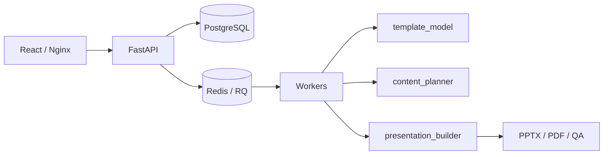

# PresD

PresD создаёт презентации по готовому PPTX-шаблону, брифу и пользовательским
материалам. Сервис анализирует структуру шаблона, строит проверенный контент-план,
заполняет слайды и отдаёт готовые PPTX и PDF с превью.

## Быстрый запуск

Понадобятся Docker Engine с Compose plugin и доступ к OpenAI-compatible API.

```bash
cp webapp/.env.example webapp/.env
```

В `webapp/.env` задайте пароли, разрешённые логины, адрес API и модель. Для
локального модельного сервера на хосте используйте, например:

```dotenv
POSTGRES_PASSWORD=localPostgresPassword123
REDIS_PASSWORD=localRedisPassword456
WEBAPP_ALLOWED_CLIENTS_JSON={"admin":"localUiPassword789"}
PUBLIC_IP=127.0.0.1

LLM_BASE_URL=http://host.docker.internal:11434/v1
LLM_MODEL=your-model
LLM_API_KEY=not-needed
```

Запустите приложение:

```bash
docker compose \
  --env-file webapp/.env \
  -f webapp/compose.yaml \
  -f webapp/compose.local.yaml \
  up --build postgres redis api generation-worker template-analysis-worker template-enrichment-worker frontend
```

Интерфейс будет доступен на <http://localhost:8080>. Войдите с данными из
`WEBAPP_ALLOWED_CLIENTS_JSON`, загрузите PPTX-шаблон, добавьте бриф и материалы,
затем запустите генерацию.

Полная инструкция, включая проверку конфигурации, логи и остановку сервисов:
[локальный запуск](docs/getting-started.md).

## Архитектура



Основной пайплайн состоит из трёх этапов:

1. `template_model` разбирает PPTX и адресует содержимое по точным `shape_id`.
2. `content_planner` сопоставляет бриф и факты с макетами и проверяет план.
3. `presentation_builder` применяет план к шаблону и проверяет результат.

Подробное описание компонентов, очередей и потоков данных находится в разделе
[«Архитектура»](docs/architecture.md).

## Документация

| Раздел | Содержание |
| --- | --- |
| [Обзор документации](docs/README.md) | Карта документов и рекомендуемый порядок чтения |
| [Локальный запуск](docs/getting-started.md) | Docker Compose, первый вход и пример генерации |
| [Архитектура](docs/architecture.md) | Компоненты, очереди, хранилища и потоки данных |
| [Пайплайн генерации](docs/generation-pipeline.md) | Анализ PPTX, планирование, сборка и QA |
| [Конфигурация](docs/configuration.md) | Переменные окружения LLM, VLM и web-приложения |
| [Разработка и тестирование](docs/development.md) | Структура репозитория, окружение и тесты |
| [Production-развёртывание](docs/deployment.md) | ВМ, HTTPS, firewall, обновление и резервирование данных |

## Возможности

- загрузка и повторный анализ PPTX-шаблонов;
- генерация из текста, Markdown, PDF, DOCX, CSV, XLSX, JSON и изображений;
- native PowerPoint charts, таблицы, диаграммы и pictogram grids;
- строгий и быстрый режимы планирования;
- прогресс в реальном времени, отмена заданий и история результатов;
- экспорт PPTX и PDF, превью слайдов и QA-отчёт.

## Разработка

Настройка Python-окружения, frontend-команды, тесты и проверки перед Pull Request
описаны в разделе [«Разработка и тестирование»](docs/development.md).
