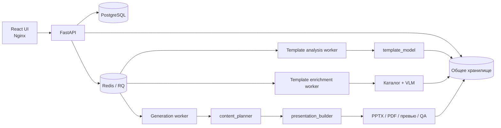

# PresD

PresD создаёт презентации по готовому PPTX-шаблону, брифу и пользовательским
материалам. Сервис анализирует структуру шаблона, строит проверенный контент-план,
заполняет слайды и отдаёт готовые PPTX и PDF с превью.

## Локальный запуск

Для основного сценария нужны Docker Engine с Compose plugin и доступ к
OpenAI-compatible API. Python, Node.js, PostgreSQL и Redis на хост устанавливать
не требуется — они работают внутри контейнеров.

1. Создайте локальный файл настроек:

   ```bash
   cp webapp/.env.example webapp/.env
   ```

2. Заполните `webapp/.env`. Для локального тестового запуска достаточно заменить
   следующие значения:

   ```dotenv
   POSTGRES_PASSWORD=localPostgresPassword123
   REDIS_PASSWORD=localRedisPassword456
   WEBAPP_ALLOWED_CLIENTS_JSON={"admin":"localUiPassword789"}

   PUBLIC_IP=127.0.0.1

   LLM_BASE_URL=http://host.docker.internal:11434/v1
   LLM_MODEL=your-model
   LLM_API_KEY=not-needed
   ```

   Этот пример рассчитан на OpenAI-compatible модельный сервер, запущенный на
   хосте, например Ollama, vLLM или LM Studio. Он должен принимать соединения от
   Docker. Для облачного API укажите его endpoint, точный идентификатор модели и
   API-ключ. Демонстрационные пароли выше не используйте в публичном окружении.

3. Проверьте конфигурацию и запустите приложение:

   ```bash
   docker compose \
     --env-file webapp/.env \
     -f webapp/compose.yaml \
     -f webapp/compose.local.yaml \
     config --quiet

   docker compose \
     --env-file webapp/.env \
     -f webapp/compose.yaml \
     -f webapp/compose.local.yaml \
     up --build postgres redis api generation-worker template-analysis-worker template-enrichment-worker frontend
   ```

4. Откройте <http://localhost:8080> и войдите под логином `admin` с паролем из
   `WEBAPP_ALLOWED_CLIENTS_JSON`.

### Пример работы

1. На странице «Шаблоны» загрузите PPTX с нужным дизайном и дождитесь окончания
   анализа.
2. На странице «Создать» опишите задачу, добавьте исходный текст, документы,
   таблицы или изображения и выберите шаблон.
3. Укажите диапазон количества слайдов и запустите генерацию.
4. На странице результата просмотрите слайды и скачайте PPTX или PDF.

Проверить API после запуска можно командой:

```bash
curl http://localhost:8080/api/health
```

Для остановки без удаления базы, файлов и других Docker volumes используйте:

```bash
docker compose \
  --env-file webapp/.env \
  -f webapp/compose.yaml \
  -f webapp/compose.local.yaml \
  down
```

Настройка ВМ, HTTPS, firewall и обновление production-инсталляции описаны в
[документации web-приложения](webapp/README.md).

## Как всё устроено

На верхнем уровне PresD — web-приложение с асинхронной обработкой. API принимает
шаблоны и материалы, сохраняет метаданные в PostgreSQL, ставит тяжёлые операции
в очереди Redis/RQ и сообщает интерфейсу о ходе выполнения. Отдельные worker-процессы
анализируют шаблоны и собирают презентации.



Сам пайплайн состоит из трёх основных этапов:

1. `template_model` разбирает исходный PPTX и делает содержимое каждого слайда
   адресуемым по точным `shape_id`.
2. `content_planner` сопоставляет бриф и факты с подходящими макетами, строит план
   презентации и проверяет его.
3. `presentation_builder` детерминированно применяет план к шаблону и выполняет
   финальную QA-проверку результата.

## Архитектура подробнее

### Web-интерфейс и API

Frontend написан на React и собирается Vite. В контейнере его раздаёт Nginx,
который также проксирует `/api` в FastAPI. Интерфейс позволяет:

- загружать, переанализировать и удалять PPTX-шаблоны;
- создавать презентации из брифа, текста и файлов;
- следить за прогрессом задания и отменять его;
- просматривать историю, предупреждения QA и превью;
- скачивать результат в PPTX и PDF.

FastAPI отвечает за аутентификацию, проверку входных файлов, управление шаблонами
и заданиями. PostgreSQL хранит пользователей, сессии и состояние задач. Redis
используется как broker очередей RQ. Исходники и артефакты лежат в общем volume,
но логически изолированы по пользователям.

Тяжёлые операции разделены между очередями:

- `template-analysis` выполняет первичный структурный анализ шаблона;
- `template-enrichment` строит семантический каталог и при необходимости запускает
  VLM-анализ;
- `generation` извлекает материалы, строит план, собирает презентацию и создаёт
  артефакты QA.

### 1. Анализ шаблона

`template_model` декомпозирует презентацию на слайды и описывает адресуемый
контент каждого слайда. Он сохраняет текстовые блоки, изображения, таблицы,
графики, media и вложенные группы вместе с типом, нормализованными координатами,
точным текстом и `shape_id`. Линии и фигуры без контента пропускаются.

```bash
python -m template_model analyze \
  --template input.pptx \
  --output presentation_model
```

Результат создаётся атомарно, а непустой выходной каталог не перезаписывается:

```text
presentation_model/
├── source.pptx
├── presentation.json
└── slides/
    ├── slide_001/
    │   ├── metadata.json
    │   └── preview.png
    └── slide_002/
        ├── metadata.json
        └── preview.png
```

`presentation.json` содержит сведения об исходнике и индекс слайдов, а
`metadata.json` — структуру конкретного слайда. Превью создаются через
LibreOffice и `pdftoppm`; ошибка рендера не мешает сохранить структурные
метаданные.

VLM-анализ можно включить отдельно:

```bash
python -m template_model analyze \
  --template input.pptx \
  --output presentation_model_vlm \
  --vlm
```

VLM добавляет `classification`, `tags`, `description` и `confidence`. Ошибка на
отдельном слайде записывается в `vlm.status` и `vlm.error`, не отменяя структурный
анализ. По умолчанию используются настройки `LLM_*`; отдельную визуальную модель
можно настроить переменными `VLM_BASE_URL`, `VLM_MODEL`, `VLM_API_KEY`,
`VLM_PROJECT`, `VLM_API_MODE` и `VLM_TIMEOUT`.

Корневой `main.py` сохранён как обратно совместимая обёртка CLI.

### 2. Каталог и контент-план

`content_planner` превращает бриф и контент-пакет в проверенный план, привязанный
к конкретным слайдам и `shape_id`. Сначала он строит компактный каталог логических
слотов: связанные фигуры таблиц, графиков, карточек и профилей объединяются в один
слот, а похожие слайды — в семейства вариантов.

Каталог кэшируется рядом с моделью шаблона и обновляется при изменении исходного
PPTX или версии prompt. Его можно подготовить отдельно:

```bash
python -m content_planner build-catalog \
  --template-dir template_model/output/run_4 \
  --workers 4
```

После этого план генерируется командой:

```bash
python -m content_planner generate \
  request.json \
  --template-dir template_model/output/run_4 \
  --output plan.json
```

Пример `request.json`:

```json
{
  "brief": "Представить продукт и команду продуктовому комитету.",
  "content_package": "- Анна Лебедева — руководитель продукта.\n- Платформой пользуются 42 команды.",
  "slide_count": {
    "min": 5,
    "max": 7
  }
}
```

Контент-пакет может быть обычным текстом или Markdown. Абзацы и элементы списка
получают стабильные ID. Планировщик проверяет числа по источникам, обязательные
факты, существование `shape_id` и вместимость слотов. Каждый заполненный слот в
`plan.json` содержит ссылки `source_refs` на использованные фрагменты входных
данных.

По умолчанию планировщик строит общий outline, параллельно генерирует слайды,
запускает три профильные проверки и выполняет до двух раундов исправлений.
Параллелизм ограничен `WEBAPP_PLANNER_MAX_WORKERS` — от 1 до 8, по умолчанию 4.

Для быстрого черновика доступен режим `--fast`: он отключает ансамбль и
семантическую критику, но сохраняет структурную ревизию и детерминированные
проверки источников, чисел и вместимости.

```bash
python -m content_planner generate \
  request.json \
  --template-dir template_model/output/run_4 \
  --output plan.json \
  --fast
```

Готовый демонстрационный сценарий про IT-команду, три продукта и roadmap:

```bash
python -m content_planner demo \
  --template-dir template_model/output/run_4 \
  --output content_planner/output/it_team_plan.json
```

Тот же сценарий можно передать универсальной команде `generate`:

```bash
python -m content_planner generate \
  content_planner/examples/it_team_request.json \
  --template-dir template_model/output/run_4 \
  --output content_planner/output/it_team_plan.json
```

### Структурированные данные и изображения

В `PlanningRequest` можно передать `structured_assets` типов `dataset`, `diagram`
и `pictogram_grid`. Web-интерфейс также извлекает datasets из CSV, XLSX, JSON,
Markdown- и DOCX-таблиц. `visual_hint` поддерживает режимы `auto`, `none` и
`force`; при выборе визуализации значения и порядок данных не меняются.

Chart-datasets обрабатываются отдельно: модель выбирает место слайда в narrative
и заголовок, а код подбирает chart/content_visual canvas, делит данные максимум
по 12 категорий и создаёт нативный PowerPoint chart. Для универсального контейнера
задайте фигуре имя или alt text `presd:visual`, например
`presd:visual:chart,table`.

Для изображений доступны действия `keep`, `replace`, `generate` и `clear`.
Внешность людей без переданных фотографий не генерируется.

### 3. Сборка и QA

`presentation_builder` собирает презентацию из проверенного плана. Он копирует
выбранные слайды вместе с оформлением, допускает повторное использование одного
шаблонного слайда и применяет изменения по точным `shape_id`.

```bash
python -m presentation_builder build \
  --template-dir template_model/output/run_4 \
  --plan content_planner/output/plan.json \
  --assets-dir assets \
  --output presentation.pptx
```

Относительные `asset_ref` разрешаются только внутри `--assets-dir`. PPTX
публикуется атомарно и не перезаписывает существующий файл. Рядом создаётся
каталог `presentation.qa` с `report.json` и превью. Ошибка LibreOffice попадает в
предупреждения, но не отменяет корректно собранный PPTX.

Текущие сборщик и планировщик используют версии каталога и плана `5.0`. После
изменения шаблона каталог и план нужно создать заново; уже собранные PPTX остаются
доступными.

Действие `generate` для изображений подключается через Python API:

```python
from presentation_builder import PresentationBuilder

report = PresentationBuilder(image_generator=my_generator).build(
    "template_model/output/run_4",
    "content_planner/output/plan.json",
    "presentation.pptx",
    assets_dir="assets",
)
```

Без реализации `ImageGenerator` попытка выполнить действие `generate`
завершается строгой ошибкой.

## Настройка LLM

Python CLI и worker-процессы используют OpenAI-compatible API:

```dotenv
LLM_BASE_URL=http://localhost:11434/v1
LLM_MODEL=your-model
LLM_API_KEY=not-needed
LLM_API_MODE=chat_completions
LLM_STRUCTURED_OUTPUT=native
LLM_TIMEOUT=90
```

Для worker-контейнеров адрес сервера на хосте должен использовать
`host.docker.internal` вместо `localhost`. `LLM_API_MODE` принимает
`chat_completions` или `responses`. Если endpoint не поддерживает native JSON
Schema, задайте `LLM_STRUCTURED_OUTPUT=prompt`: схема будет добавлена в prompt
без специального параметра API. `LLM_PROJECT` необязателен, а ключ может быть
пустым для локального сервера без авторизации.

Промпты планировщика находятся в `content_planner/prompts` и версионируются
отдельно от кода.

## Разработка и тесты

Установить зависимости Python и запустить все тесты:

```bash
python -m venv .venv
source .venv/bin/activate
pip install -r requirements.txt -r webapp/backend/requirements-dev.txt
pytest
```

Запустить только backend-тесты с SQLite:

```bash
WEBAPP_DATABASE_URL=sqlite+pysqlite:///./webapp-test.db \
WEBAPP_DATA_ROOT=/tmp/presd-test \
pytest webapp/backend/tests
```

Frontend:

```bash
cd webapp/frontend
npm install
npm test
npm run build
```

Подробности production-развёртывания и сетевой изоляции находятся в
[`webapp/README.md`](webapp/README.md).
