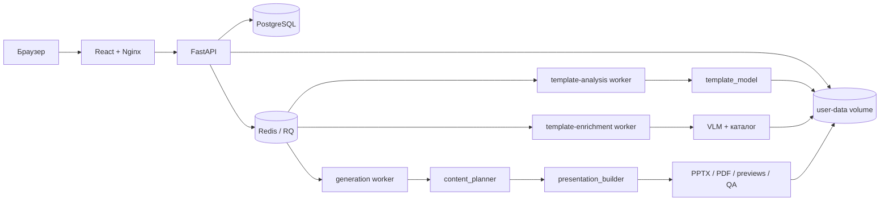
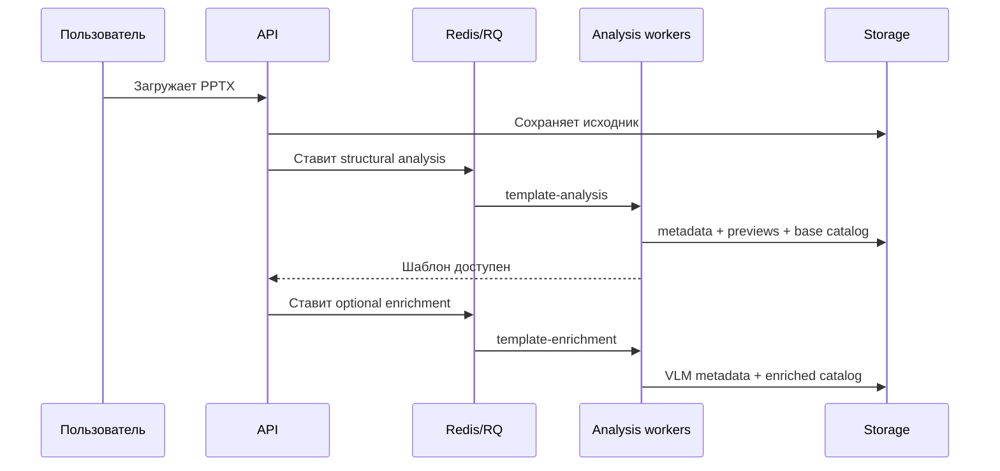
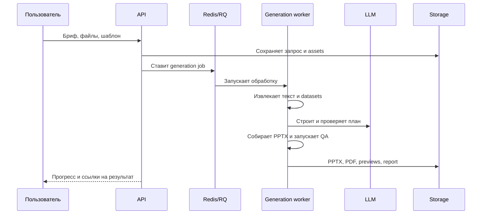

# Архитектура

PresD состоит из web-интерфейса, API, двух хранилищ состояния, общего файлового
хранилища и трёх специализированных worker-процессов. Долгие операции выполняются
асинхронно, поэтому перезапуск HTTP-запроса не влияет на уже поставленное задание.

## Общая схема

## Компоненты

### Frontend

React-приложение предоставляет четыре основных экрана:

- создание презентации;
- библиотека шаблонов;
- история заданий;
- состояние и результат конкретного задания.

В production-сборке статические файлы раздаёт Nginx. Он же проксирует `/api` в
FastAPI и поддерживает поток событий о ходе задания.

### API

FastAPI отвечает за:

- вход и выход пользователей;
- загрузку, просмотр, переанализ и удаление шаблонов;
- валидацию брифа и входных файлов;
- создание, просмотр и отмену заданий;
- выдачу PPTX, PDF и превью;
- постановку фоновых операций в очереди RQ.

Самостоятельной регистрации нет. Разрешённые логины и исходные пароли задаются в
`WEBAPP_ALLOWED_CLIENTS_JSON`; при первом успешном входе пользователь создаётся в
базе, а пароль сохраняется как Argon2id-хеш.

### PostgreSQL

База хранит пользователей, сессии, шаблоны, задания, приложенные файлы и события
прогресса. Крупные бинарные файлы в PostgreSQL не записываются: модели шаблонов и
результаты находятся в файловом volume, а таблицы содержат относительные пути.

### Redis и RQ

Redis хранит очереди фоновых задач. Работа разделена между тремя процессами:

| Очередь | Назначение |
| --- | --- |
| `template-analysis` | Проверка PPTX, извлечение структуры и базовый каталог |
| `template-enrichment` | VLM-анализ слайдов и обновление семантического каталога |
| `generation` | Извлечение материалов, планирование, сборка и QA |

Worker восстанавливает один раз незавершённое задание после инфраструктурного
перезапуска. Повторный системный сбой фиксируется как ошибка; для необязательного
визуального обогащения уже готовая базовая модель остаётся доступной.

### Файловое хранилище

Docker volume `user-data` подключён к API и workers. В нём находятся загруженные
PPTX, нормализованные материалы, модели шаблонов, планы и конечные артефакты.
Пути проверяются относительно корня хранилища, чтобы входные `asset_ref` не могли
обратиться к произвольному файлу на хосте.

## Анализ шаблона

Базовая версия шаблона становится доступной до завершения необязательного
VLM-обогащения. Это уменьшает время до первой генерации и позволяет работать с
текстовой моделью без поддержки изображений.

## Генерация презентации

Прогресс записывается как события и передаётся интерфейсу через Server-Sent
Events. При недоступности потока frontend переключается на периодический polling.
Отмена задания отправляет команду RQ и проверяется самим pipeline в контрольных
точках.

## Сетевые границы

При локальном запуске наружу опубликован только frontend на `127.0.0.1:8080`.
В production публикуются порты gateway `80` и `443`. API, PostgreSQL и Redis
работают во внутренних Docker-сетях. Исходящий доступ к модельному API получают
worker-контейнеры; frontend и база в нём не нуждаются.

Подробнее:

- [Пайплайн генерации](generation-pipeline.md)
- [Конфигурация](configuration.md)
- [Production-развёртывание](deployment.md)
